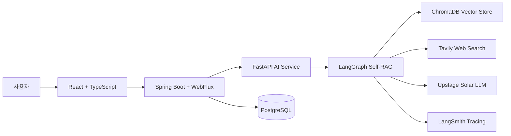
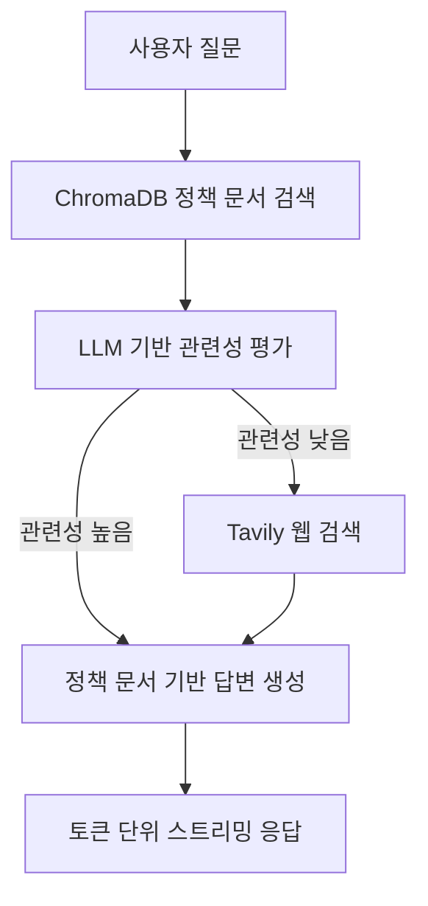

# Youth Compass

청년을 위한 AI 기반 금융 및 주택 정책 상담 챗봇 서비스입니다.

Youth Compass는 청년들이 복잡한 정책 문서를 직접 탐색하지 않아도, 자연어 대화로 본인 조건에 맞는 정책 정보를 확인할 수 있도록 설계했습니다. 
내부 정책 PDF 문서 기반 RAG와 최신 웹 검색을 함께 활용해 답변의 정확성과 최신성을 보완합니다.

## 핵심 기술 기여

- **LangGraph 기반 Self-RAG 워크플로우 설계**
- **Tavily Web Search 조건부 라우팅 구현**
- **FastAPI + Spring WebFlux 기반 스트리밍 파이프라인 구축**
- **LangSmith 기반 LLMOps 추적 체계 구축**
- **ChromaDB 메타데이터 기반 검색 정확도 개선**

## 팀 프로젝트 및 개인 기여

Youth Compass는 총 5명의 팀원이 함께 진행한 팀 프로젝트입니다.

- **담당 역할**: AI 융합 백엔드 엔지니어
- **기여 범위**: AI 서비스 인프라, RAG 파이프라인, LLM 워크플로우, 스트리밍 응답 처리

### 주요 기여

- Jupyter Notebook 기반 실험 코드를 FastAPI 기반 독립 AI 서비스로 구조화했습니다.
- LangGraph로 문서 검색, 관련성 평가, 웹 검색 라우팅, 답변 생성을 연결한 Self-RAG 워크플로우를 구현했습니다.
- 내부 문서만으로 답변이 부족할 경우 Tavily Web Search로 최신 정보를 보완하도록 조건부 분기를 구성했습니다.
- FastAPI AI 서버와 Spring WebFlux 백엔드를 연결해 토큰 단위 스트리밍 응답 파이프라인을 구축했습니다.
- LangSmith를 연동해 토큰 사용량, 노드 전환 흐름, 예외 발생 지점을 추적할 수 있도록 했습니다.
- 정책 PDF의 파일 경로와 폴더 구조에서 정책명, 대도메인, 문서 유형 메타데이터를 추출해 ChromaDB 검색 컨텍스트에 반영했습니다.

## 아키텍처



### AI 워크플로우



## 트러블슈팅

### 문제: RAG 응답의 첫 토큰 지연

초기 구조에서는 ChromaDB 문서 검색, Tavily 웹 검색, LLM 최종 추론이 순차적으로 처리되어 전체 답변 생성 시간이 길어졌습니다. 특히 사용자는 첫 문장이 표시되기 전까지 대기해야 했기 때문에 실제 지연보다 체감 지연이 더 크게 느껴졌습니다.

### 해결: 스트리밍 응답 파이프라인 구축

- FastAPI AI 서버에서 LLM 토큰을 생성 즉시 스트리밍하도록 개선했습니다.
- Spring WebFlux 기반 백엔드에서 AI 서버의 스트림을 논블로킹 방식으로 받아 클라이언트에 전달했습니다.
- 전체 답변 생성 시간은 RAG와 LLM 추론 과정 때문에 다소 소요되지만, 스트리밍 방식을 적용해 사용자가 체감하는 첫 응답 속도를 약 **4초에서 1초 수준**으로 줄였습니다.

## 기술 스택

### AI Service

- **LangGraph**: Self-RAG 워크플로우 구성
- **LangChain**: LLM 체인 및 프롬프트 관리
- **Upstage Solar LLM / Embeddings**: 한국어 정책 상담 답변 및 문서 임베딩
- **ChromaDB**: 정책 PDF 벡터 검색
- **Tavily**: 최신 웹 검색
- **LangSmith**: LLMOps 추적 및 모니터링
- **FastAPI**: AI 추론 API 및 스트리밍 응답

### Backend

- **Spring Boot 3.5**
- **Spring WebFlux**
- **PostgreSQL**

### Frontend

- **React 18**
- **TypeScript**
- **Vite**
- **Shadcn/ui**
- **TanStack Query**
- **Supabase Auth**

### Infra

- **Docker Compose**
- **PostgreSQL**
- **ChromaDB**

## 프로젝트 구조

```text
youth-compass/
├── frontend/              # React + TypeScript 프론트엔드
├── backend/               # Spring Boot 백엔드
├── ai-service/            # FastAPI AI 서비스, LangGraph RAG 파이프라인
├── infra/                 # 인프라 설정
├── docs/                  # 프로젝트 문서
└── docker-compose.yml
```

## 실행 방법

### 1. 환경 변수 설정

```bash
cp .env.example .env
```

필수 API 키를 `.env`에 입력합니다.

```bash
UPSTAGE_API_KEY=your_upstage_api_key_here
TAVILY_API_KEY=your_tavily_api_key_here
```

LangSmith 추적을 사용할 경우 다음 값을 추가합니다.

```bash
LANGCHAIN_TRACING_V2=true
LANGCHAIN_API_KEY=your_langsmith_api_key_here
LANGCHAIN_PROJECT=youth-compass
```

### 2. Docker Compose 실행

```bash
docker-compose up --build
```

### 3. 서비스 접속

- **Frontend**: http://localhost:3000
- **Backend API**: http://localhost:8080
- **AI Service**: http://localhost:8000
- **ChromaDB**: http://localhost:8001

## 주요 기능

- 자연어 기반 청년 금융 및 주택 정책 상담
- 사용자 프로필 기반 맞춤형 정책 추천
- 내부 정책 PDF 기반 RAG 답변
- Tavily 웹 검색을 통한 최신 정보 보완
- 토큰 단위 실시간 스트리밍 응답
- PDF 문서 출처와 웹 검색 출처 구분
- Supabase 기반 사용자 인증

## 관련 문서

- [AI_SERVICE_SETUP.md](AI_SERVICE_SETUP.md): AI 서비스 설정 가이드
- [CHROMADB_MIGRATION.md](CHROMADB_MIGRATION.md): ChromaDB 마이그레이션 가이드
- [DOCKER_SETUP.md](DOCKER_SETUP.md): Docker 설정 상세 가이드

## Contributors

이 프로젝트는 총 5명의 팀원이 함께 개발했습니다.

- **Shawn Choi** ([@shawnchoi8](https://github.com/shawnchoi8))
- **WonJun** ([@WONJUN-KR](https://github.com/WONJUN-KR))
- **minwoojoo** ([@minwoojoo](https://github.com/minwoojoo))
- **meaningGitt** ([@meaningGitt](https://github.com/meaningGitt))
- **PioKwon** ([@PioKwon](https://github.com/PioKwon))

## 라이선스

이 프로젝트는 교육 목적으로 개발되었습니다.
